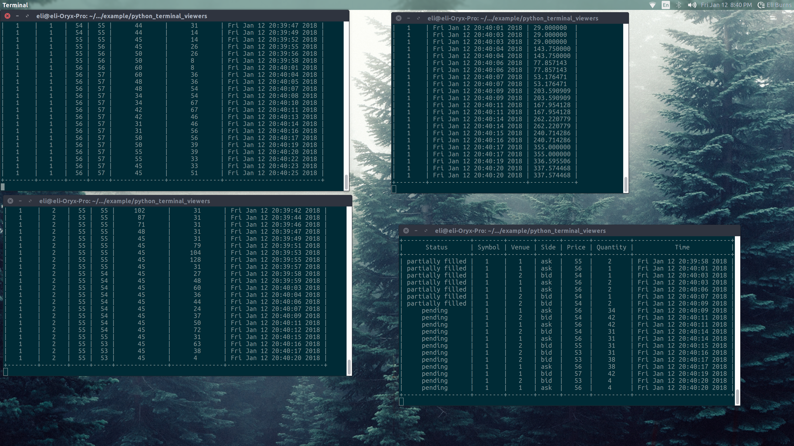

# Running Example

## Usage

In this directory is a program that shows an example of the trading system
in action using data from the *simulated\_data.csv* file, located in the
 data directory.


To run the primitive data base viewers, we can execute these commands
from separate terminal windows (after making sure MongoDB is running):
```
$ python3 python3 book_viewer.py -N 3
```
```
$ python3 python3 book_viewer.py -N 5
```
```
$ python3 python3 pnl_viewer.py -N 7
```
```
$ python3 python3 trader_viewer.py -N 7
```



After compiling and running the executable **trading_system**, we should
see something similar to the above, with data being populated for the
top of book of the symbol from each venue it's listed at, data on the trades
that *arbitrage_trader* executed, and data on updates to the PnL.

*note: the parameters that we entered above correspond to the ID's that
we chose for the respective trading system components in **main.cpp.***

## Notes

It's likely you'll experience a segmentation fault while running this. I've
narrowed its source down to the *cumulative_volume<bid>* function and will
update this readme after this has been fixed. Expect more details to be added
to this readme file in the coming days.

## Requirements

You'll need to have MongoDB installed. If there's problems compiling, it
could be very possible that you'll need to modify the paths to MongoDB in
CMake file.
